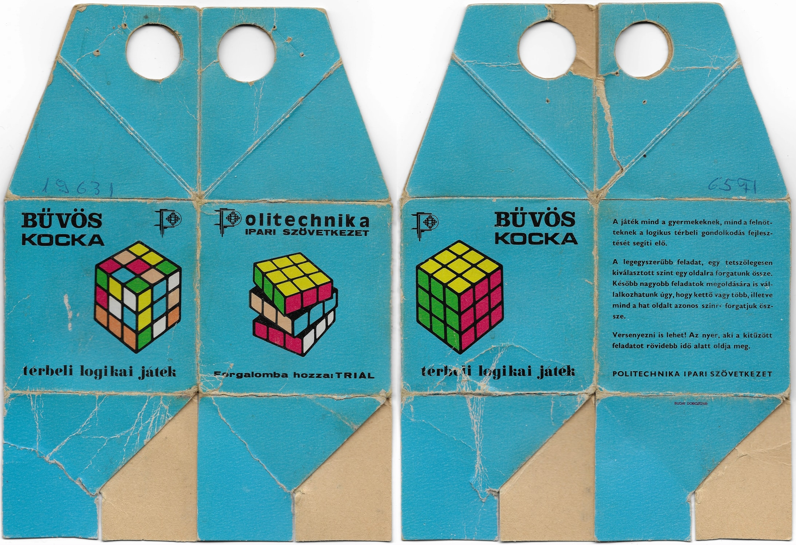

# Magic Cube Boxes

In this repository you'll find a collection of high-quality scans of the boxes for all 20 known variants of the Magic Cube produced by Politechnika (later Politoys) from 1977 to 1982. More info available [here](http://twistypuzzles.com/forum/viewtopic.php?p=411019#p411019). The Magic Cube was the precursor to the Rubik's Cube™, and was manufactured in Budapest, Hungary for some time before its introduction to the U.S. market. It took me 5 years to collect at least one of each variant.

**All images contained herein are the sole property of [Nathan Buchar](https://nathanbuchar.com). They have been made available in good fath and licensed under a [Creative Commons Attribution-NonCommercial-ShareAlike 4.0 International License](https://creativecommons.org/licenses/by-nc-sa/4.0/). Scroll to the bottom of this page for more info on licensing, reuse, and proper attribution.**

<br />
<br />
<p align="center">
  
</p>
<br />
<br />

## Contents

| Code | Name |
| :--: | :--- |
| `00` | [Politechnika Magic Cube, Hungarian, 1st edition (c. 1977)](./scans/00) |
| `01` | [Politechnika Magic Cube, Hungarian, 2nd edition (c. 1978)](./scans/01) |
| `02` | [Politechnika Magic Cube, Hungarian, 3rd edition (c. 1979)](./scans/02) |
| `03` | [Politechnika Magic Cube, German, CCM](./scans/03) |
| `04` | [Politechnika Magic Cube, German, CCM + Spielewaren](./scans/04) |
| `05` | [Politechnika Magic Cube, German, Spielewaren](./scans/05) |
| `06` | [Politechnika Magic Cube, English](./scans/06) |
| `07` | [Politechnika Magic Cube, French](./scans/07) |
| `08` | [Politoys Magic Cube, Hungarian](./scans/08) |
| `09` | [Politoys Magic Cube, English, Short name Hungarian](./scans/09) |
| `10` | [Politoys Magic Cube, English, Long name Hungarian](./scans/10) |
| `11` | [Politoys Magic Cube, French, Short name Hungarian](./scans/11) |
| `12` | [Politoys Magic Cube, French, Long name Hungarian](./scans/12) |
| `13` | [Politoys Magic Cube, German, Short name Hungarian](./scans/13) |
| `14` | [Politoys Magic Cube, German, Long name Hungarian](./scans/14) |
| `15` | [Politoys Magic Cube, Russian](./scans/15) |
| `16` | [Politoys Magic Cube, Serbo-Croatian](./scans/16) |
| `17` | [Politoys Rubik's Cube, Hungarian](./scans/17) |
| `18` | [Politoys Rubik's Cube, English](./scans/18) |
| `19` | [Politoys Rubik's Cube, French](./scans/19) |
| `20` | [Politoys Rubik's Cube, German](./scans/20) |


## Copyright 

**All images contained herein are the sole property of [Nathan Buchar](https://nathanbuchar.com). They have been made available in good fath and licensed under a [Creative Commons Attribution-NonCommercial-ShareAlike 4.0 International License](https://creativecommons.org/licenses/by-nc-sa/4.0/).**

If you wish to share, reupload, or distribute any of these images, please provide proper attribution. The following is an example of a good attribution:

> _[Photo](photo-url) by [Nathan Buchar](https://nathanbuchar.com) / [CC BY-NC-SA 4.0](https://creativecommons.org/licenses/by-nc-sa/4.0/)_

Where `photo-url` is the URL of the original photo. To help create an attribution like the one above, you can use one of the templates below.

HTML:

```
<a href="photo-url">Photo</a> by <a href="https://nathanbuchar.com">Nathan Buchar</a> / <a href="https://creativecommons.org/licenses/by-nc-sa/4.0/">CC BY-NC-SA 4.0</a>
```

TwistyPuzzles.com:

```
[url=photo-url]Photo[/url] by [url=http://twistypuzzles.com/forum/memberlist.php?mode=viewprofile&u=10503]Nathan Buchar (Blase)[/url] / [url=https://creativecommons.org/licenses/by-nc-sa/4.0/]CC BY-NC-SA 4.0[/url]
```

For questions regarding licensing or proper attribution, contact [hello@nathanbuchar.com](mailto:hello@nathanbuchar.com?subject=Licensing).